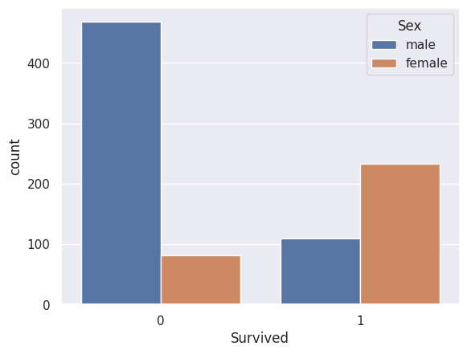
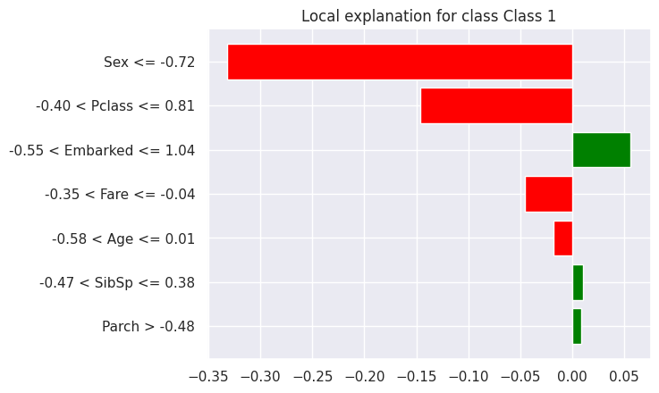
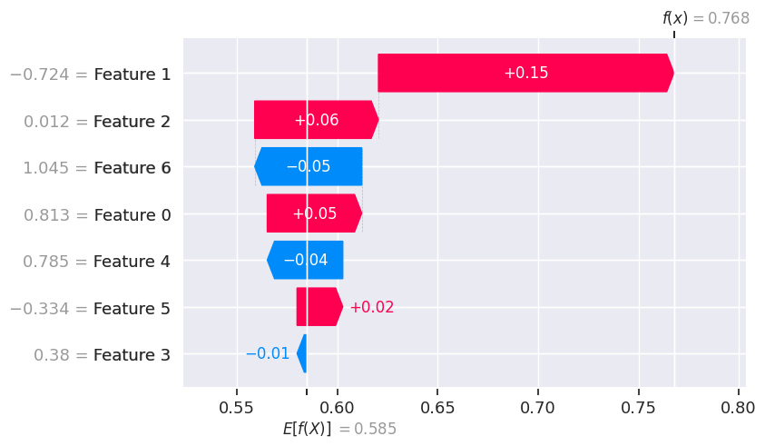

# 🚢 Titanic Survival Prediction Project

## 📋 Overview
This project implements machine learning models to predict passenger survival on the Titanic. Beyond basic prediction, the project incorporates explainable AI techniques (LIME and SHAP) to provide insights into model decision-making and includes a comparative study of different ML algorithms.

## 🔍 Features
- Prediction of Titanic passenger survival using multiple ML algorithms
- Data preprocessing and feature engineering
- Feature correlation visualization using bar graphs
- Model comparison and performance evaluation
- Explainable AI implementation using LIME and SHAP

## 🛠️ Technologies Used
- **Python**: Core programming language
- **Pandas**: Data manipulation and analysis
- **Scikit-learn**: Machine learning algorithms implementation
- **Matplotlib/Seaborn**: Data visualization
- **LIME**: Local Interpretable Model-agnostic Explanations
- **SHAP**: SHapley Additive exPlanations

## 📊 Dataset
The project uses the famous Titanic dataset from Kaggle, which includes:
- Passenger information (age, gender, class, fare, cabin, etc.)
- Survival outcome (target variable)
- Family information (siblings/spouses, parents/children)
- Ticket information

## 🧮 Model Performance
| Model                | Accuracy |
|----------------------|----------|
| Logistic Regression  | 0.7989   |
| Random Forest        | 0.8212   |
| SVM                  | 0.6536   |
| Gradient Boosting    | 0.8156   |

## 🧹 Data Preprocessing Steps
1. Handling missing values
2. Feature engineering
3. Categorical encoding
4. Feature scaling
5. Outlier detection and treatment

## 📈 Exploratory Data Analysis (EDA)

Visualized relationships between features and survival rates:

- **Gender**: Higher survival rate for females.
- **Passenger Class**: 1st class passengers had higher survival rates.
- **Age**: Younger passengers had higher chances of survival.

*Example Visualization:*

## 🔮 Explainable AI Implementation
### LIME (Local Interpretable Model-agnostic Explanations)
- Implemented to explain individual predictions
- Provides insight into which features most influenced specific predictions
-   *LIME Explanation Example:*

  

### SHAP (SHapley Additive exPlanations)
- Used to understand the impact of each feature on the model output
- Provides global interpretability of the model
-   *SHAP Summary Plot:*

  

## 📈 Visualizations
- Feature correlation heatmaps
- Survival rate by passenger class, gender, and age groups
- SHAP summary plots
- LIME explanation visualizations

## 🔍 Results and Insights

- **Random Forest** achieved the highest accuracy (82.12%).
- Key influential features identified:
  - **Gender**: Being female significantly increased survival probability.
  - **Class**: Third-class passengers had significantly lower survival rates.
  - **Fare**: Higher ticket fares correlated with better survival chances.

## 🔮 Future Improvements

- Implement ensemble methods for potentially higher accuracy.
- Explore advanced feature engineering techniques.
- Investigate deep learning approaches.
- Develop an interactive dashboard for result visualization.
- Apply cross-validation for more robust evaluation.

